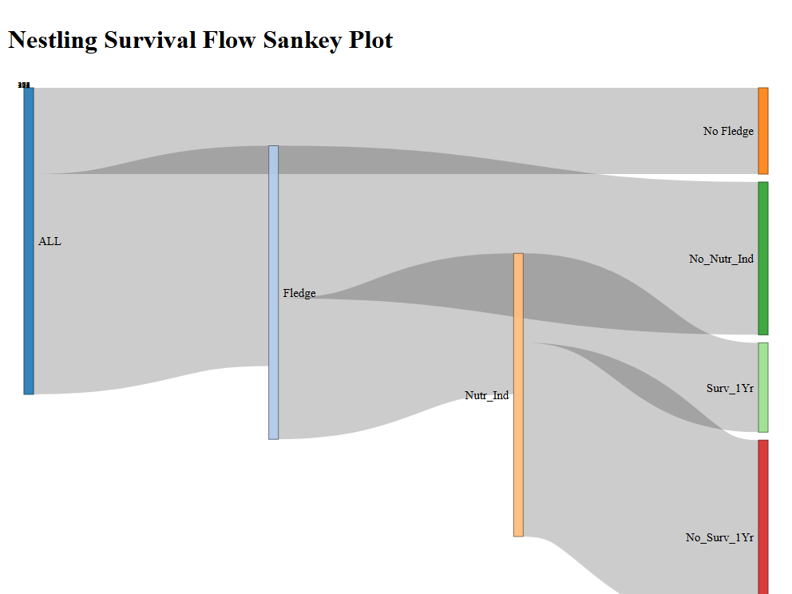

```{r setup, include=FALSE}
knitr::opts_knit$set(root.dir = normalizePath("C:/Users/Admin/Desktop/UCT_Masters_Coursework/EDA_Assignment_1/STA5092Z_2026_Assignment1"))

knitr::opts_knit$set(root.dir = rprojroot::find_rstudio_root_file())

knitr::opts_chunk$set(dev = "pdf")
knitr::opts_chunk$set(warning = FALSE, message = FALSE)

getwd()
```

```{r,include=FALSE}

# Import packages
#| echo: false
library(lubridate)
library(dplyr)
library(janitor)
library(tidyverse)
library(scales)
library(ggridges)
library(webshot2)
library(plotly)
library(here)
# library(kableExtra)
# library(kable)
```

# Part 1- Data Wrangling

2\) Load data and transform into tibble objects

```{r data_load}
#| echo: false
fledg_survival=tibble::as_tibble(read.csv('Data/Data.Bourne_FledglingSurvival.csv'))
fledg_survival_meta=tibble::as_tibble(read.csv('Data/Data.Bourne_FledglingSurvival_Meta.csv'))

nest_all=tibble::as_tibble(read.csv('Data/Data.Bourne_NestlingsAllData.csv'))
nest_all_meta=tibble::as_tibble(read.csv('Data/Data.Bourne_NestlingsAllData_Meta.csv'))

nest_succ=tibble::as_tibble(read.csv('Data/Data.Bourne_NestSuccess.csv'))
nest_succ_meta=tibble::as_tibble(read.csv('Data/Data.Bourne_NestSuccess_Meta.csv'))


```

Rename columns in nest_all to match those to fledg_survival. In this case, columns 'GRP' and 'Group' mean the same thing in both dataframes, so 'GRP' is renamed to 'Group' in the nest_all data frame.

3\) *DataFrame Column Data Types*

Key Findings before merging:

**fledg_survival** dataframe

-   Total Number of Rows=427 rows

-   Total number of unique Bird IDs=425

-   Data types in columns are mostly split between character and int/numeric data types

-   **Date** column in fledg_survival is stored as a character- will need to be converted. The data format is of the format dd-mm-yy using lubridate package

-   **SurvMassAtInd** column contains null values

-   **Group** which denotes which nest group a bird belongs to- however this is named differently in the nest_all dataframe

**nest_all** dataframe

-   Total number of rows=596

-   Total number of unique Bird IDs=586

-   In addition to numeric and int/numeric data types, columns also include logical/boolean data types

-   **Date** is also a character data type, similar to the format in the **fledg_survival** dataframe

The key differences between the datasets is summarized in the table below:

```{r tab_diff}
#| echo: false
# add more 
unique_brd_ids_nest=nest_all %>% 
  summarize(distint_nr=n_distinct(BirdID)) %>% 
  pull(distint_nr)

unique_nest_ids_nest=nest_all %>% 
  summarize(distint_nr=n_distinct(NestID)) %>% 
  pull(distint_nr)


unique_brd_ids_fl=fledg_survival%>% 
  summarize(distint_nr=n_distinct(BirdID)) %>% 
  pull(distint_nr)

unique_nest_ids_fl=fledg_survival%>% 
  summarize(distint_nr=n_distinct(NestID)) %>% 
  pull(distint_nr)


unique_nest_ids_ns=nest_succ%>% 
  summarize(distint_nr=n_distinct(NestCode)) %>% 
  pull(distint_nr)


tab_diff=data.frame(
  attribute=c('number of rows','number of columns','number of unique Bird IDs', 'number of unique Nest IDs'),
  nest_all_data=c(nrow(nest_all),ncol(nest_all),unique_brd_ids_nest, unique_nest_ids_nest),
  #nest_succ_data=c(nrow(nest_succ),ncol(nest_succ),NA, unique_nest_ids_ns),
  fledg_survival_data=c(nrow(fledg_survival),ncol(fledg_survival),unique_nest_ids_fl, unique_nest_ids_nest)
  

)


knitr::kable(tab_diff) 
```

*Pre Merging Data Preparation Steps*:

1.  Rename columns in nest_all to match those to fledg_survival. In this case, columns 'GRP' and 'Group' mean the same thing in both dataframes, so 'Group' is renamed to 'GRP' in the nest_all data frame.
2.  Find common column names in both the **nest_all** and **fledg_survival** data sets to find columns to join on. Particulary, for the **Date** column, this will be convert date columns in both data frames into datetime columns using the lubridate ymd function
3.  Check and ensure that the datatypes of these common columns are the same in both data sets- using the janitor package- and change any datatype mismatches to the same data type
4.  Both Both GrpSizeAD and GrpSizeTotal columns are stored as characters in the nest_all data frame, as they both contain #NA values
5.  These will replaced with na values instead, once they are coerced into integer values

*Find Common columns and check their datatypes- highlighting the mismatches*

```{r data_join}
#| echo: false
#| label: tbl-cars-kable-arg
#| tbl-cap: "Data type mismatch between common columns in nest_all and fledge survival datasets"


fledg_survival_=fledg_survival %>% rename(GRP=Group) 
# Find common columns in all three dataframes 
common_cols=intersect(names(fledg_survival_), names(nest_all) )

# Select the common cols in both data frames
fledg_survival_common =fledg_survival_ %>% select( all_of(common_cols))

nest_all_common =nest_all %>% select( all_of(common_cols))

#nest_succ_common =nest_succ %>% select( all_of(common_cols))

 
# compare data types between dataframes
mismatches =compare_df_cols(fledg_survival_common, nest_all_common, return = "mismatch")

knitr::kable(mismatches)
#,caption="Data type mismatch between common columns in nest_all and fledge survival datasets") 


```

Columns, **GrpSizeAD** and **GrpSizeTotal** are different data types in both data sets. In particular, both GrpSizeAD and GrpSizeTotal in the nest_all dataset contain string "#NA" values- so these are being read in as chartersColumns GrpSizeAD and GrpSizeTotal have different data types in both datasets. Specifically, both GrpSizeAD and GrpSizeTotal in the nest_all dataset contain the string "#NA" values, which means they are being read as characters.Columns GrpSizeAD and GrpSizeTotal have different data types in both datasets. Specifically, both GrpSizeAD and GrpSizeTotal in the nest_all dataset contain the string "#NA" values, which means they are being read as characters.

```{r distinct_grp_size}
#| echo: false
# In particular, GrpSizeAD GrpSizeTotal in nest_all and  contains #NA values- so these are bieng read in as charaters

nest_all %>% distinct(GrpSizeTotal) %>% pull()


```

```{r  distinct_gro_ad}
#| echo: false
nest_all %>% distinct(GrpSizeAD) %>% pull()

```

To correct for this, these columns are mutated as integer columns in the nest_all data set. Doing this will preserve the numerical values in the columns as integers, whilst the character values will be stored as NA which R will recognize as null values.

**Merge Data Sets**

nest_all contains more rows and unique NestIDs than the fledge_survival data set. The latter only contains data of birds that survived to fledge, whilst the former contains information on all birds- regardless of their survival status; fledge_survival is a subset of nest_all. As such, in order to preserve information from both data sets, the data sets will be merged using a left join- which preserves all information from nest_all whilst getting additional fledging information of birds that fleged from fledg_survival.

```{r merge_dfs}

#| echo: false


nest_all_clean=nest_all %>% mutate(Date=dmy(Date),GrpSizeAD=as.integer(GrpSizeAD),GrpSizeTotal=as.integer(GrpSizeTotal) )

fledg_survival_clean=fledg_survival_ %>% mutate(Date=dmy(Date))

# Merge the two

piedbabbler=left_join(nest_all_clean,fledg_survival_clean, by=common_cols)


```

# Part 2- Data Summaries and Visualizations

1\) ***piedbabbler** samplesize per year*

```{r row_count_check}
#| echo: false
#| tbl-cap: "Sample Size Per Year"

# # number of rows
# all_birds=piedbabbler %>% distinct(BirdID) %>% pull(BirdID)
# 
# fl_birds=fledg_survival %>% distinct(BirdID) %>% pull(BirdID)
# 
# diff_=setdiff(all_birds, fl_birds)
# 
# piedbabbler %>% filter(BirdID %in% diff_) %>% distinct(	
# SurvInd)
# 
# piedbabbler %>% filter(FledgeDate=='') %>% select(FledgeDate)


samp_per_yr=piedbabbler %>% mutate(dt_year=year(Date)) %>% 
  count(dt_year) %>% 
  arrange(dt_year) %>% 
  rename(year=dt_year)

knitr::kable(samp_per_yr %>% rename(`sample size`=n)) 
```

2\)

*Null Value Check*

```{r null_val_check,fig.width = 8}
library(plotly)

#| echo: false
#| fig-cap: "Null Count Per Feature"

check_cols=c('GrpSizeAD','GrpSizeTotal','BroodSize','Mass','TMaxMeas','No.ChicksFledge','Rain90','Drought')

# Count of null values per column
# Show as percentage


fig_plt=piedbabbler %>% select (all_of(check_cols)) %>% 
  mutate(across(all_of(check_cols), ~is.na(.))) %>% 
  summarise(across(everything(), ~sum(.))) %>% 
   pivot_longer(cols=check_cols,
               names_to='Column_Variable',
               values_to = 'value') %>% 
  arrange(desc(value)) %>% 
  mutate(n_count=nrow(piedbabbler)) %>% 
  mutate(perntage_null=round((value/n_count),2)) %>% 
  mutate(name = fct_reorder(Column_Variable, desc(value))) %>% 

  ggplot(aes(x=name, y=perntage_null)) +
  geom_bar(stat = "identity")+
  geom_text(aes(label = value),
            vjust = -0.4,        
            color = "blue")+
  scale_y_continuous(labels = scales::percent, limits=c(0,0.26) )+
    labs(title = "Percentage of Null Values Per Column",x='column',
       y = "percentage null values") +
    theme_minimal()
  
fig_plt
  

```

7 of 8 selected columns contain at least one null value; the **Rain90** column has the most, with 149 missing values, accounting for \~25% of the data.

*Outlier Analysis*

**Outlier Definition:** An outlier is an individual point of data that is distant from other points in the data set. It is an anomaly in the dataset that may be caused by a range of errors in capturing, processing or manipulating data. @seldon_outliers

```{r out_lier,fig.height = 6}
#| echo: false
#| fig-cap: "Box Plot Per Feature"

# An outlier is an individual point of data that is distant from other points in the dataset. It is an anomaly in the dataset that may be caused by a range of errors in capturing, processing or manipulating data. 

# https://www.seldon.io/outlier-detection-and-analysis-methods/

# For now, use box plots to visually identify cols with outliers

piedbabbler %>% select (all_of(check_cols)) %>% 
  pivot_longer(cols=check_cols,
               names_to='Column_Variable',
               values_to = 'value') %>% 
  ggplot(aes(y = value)) +
  geom_boxplot() +
  facet_wrap(~ Column_Variable, scales = "free_y") +
  labs(title = "Distribution of Features ",
       y = "values") +
  theme_minimal()
  
```

Based on their respective boxplots, the following columns appear to contain outliers relative to their individual distributions:

-   BroodSize

-   Drought

-   GrpSizeAD

-   GrpSizeTotal

-   Mass

-   TMaxMeas

3\) *Mass and Date per Nest: Longitudinal Dataframe*

According to the nest_all metadata, the **GRP** column provides the "Group Identity" per bird. The same identifiers are used in the **NestID** column as well. This column will be used as the proxy to identify which nest a bird belongs to going forward. The **sum** is used as the aggregate to calculate mass per nest per **year.**

```{r mass_per_nest_id}

#| echo: false

# Create via groupby
# Comeback and check tomorrow

nest_tab=piedbabbler %>% 
  mutate(dt_year=year(Date)) %>% 
  group_by(GRP,dt_year) %>% 
  summarize(`Total Mass`=sum(Mass)) %>% 
  rename(Nest=GRP, Year=dt_year ) %>% 
  pivot_wider(
    names_from = Year,
    values_from = `Total Mass`
  )

knitr::kable(nest_tab)
```

4\) *Mass vs Teamparature Tipping Point \* might have to check or verify if these are missing at random*

TMaxMeas has 6% of its values as nulls. As such, the aggregate mean Mass value per **binned** values of TMaxMeas will be use to adjust for this. Null values will be replaced with the mean TMaxMeas values

```{r crit_tem, fig.width = 7}

#| echo: false

# Compute mean
temp_mean=mean(piedbabbler$TMaxMeas,na.rm = TRUE)

#Repalce null values with mean
piedbabbler %>%
    mutate(TMaxMeas=case_when( is.na(TMaxMeas)~ temp_mean,
                               TRUE ~ TMaxMeas) )  %>% 
mutate(TMaxMeas_bin = cut(TMaxMeas, seq( min(TMaxMeas), max(TMaxMeas) + 3, 3), right = FALSE)) %>%
group_by(TMaxMeas_bin) %>%
summarise(mean_mass=mean(Mass)) %>%
  ggplot(aes(x=TMaxMeas_bin,y = mean_mass,group=1)) +
  geom_line()+
  geom_point() +
  geom_vline(xintercept = '[21.5,24.5)', color = "blue", linetype = "dashed", size = 1.5)+
  
  annotate("text", 
           x = '[24.5,27.5)',  # Adjust x for horizontal positioning relative to the line
           y = 50,              # Adjust y for vertical positioning (based on plot's y-scale)
           label = paste("Tcritical"), 
           color = "blue",
           angle = 0)+
  labs(title = "Average Chick Mass by TMaxMeas ",
       x='Max Ambient Air Pressure Bin',y = "average mass") +
  theme_minimal()+
  theme(axis.text.x = element_text(angle = 60))

  


```

Observing the plot above, the average mass shows a decline when the maximum ambient air temperature exceeds 21.5 degrees (using the minimum value of the bin). The plot below filters specifically for these temperatures.

```{r crit_tem_box, fig.width = 7}

#| echo: false

# Compute mean
temp_mean=mean(piedbabbler$TMaxMeas,na.rm = TRUE)

#Repalce null values with mean
piedbabbler %>%
    mutate(TMaxMeas=case_when( is.na(TMaxMeas)~ temp_mean,
                               TRUE ~ TMaxMeas) )  %>% 
mutate(TMaxMeas_bin = cut(TMaxMeas, seq( min(TMaxMeas), max(TMaxMeas) + 3, 3), right = FALSE)) %>%
  select(Mass,TMaxMeas_bin) %>% 
  ggplot(aes(x=TMaxMeas_bin,y=Mass)) +
  geom_boxplot()+
  # annotate("text", 
  #          x = '[24.5,27.5)',  # Adjust x for horizontal positioning relative to the line
  #          y = 50,              # Adjust y for vertical positioning (based on plot's y-scale)
  #          label = paste("Tcritical"), 
  #          color = "blue",
  #          angle = 0)+
  labs(title = "Bird Mass Distribution by TMaxMeas ",
       x='Max Ambient Air Pressure Bin',y = "Mass") +
  theme_minimal()+
  theme(axis.text.x = element_text(angle = 60))
```

5.  *Mass over time per nest per season*

Again, the GRP column will be used as the proxy for the Nest that birds belong to. Since there are over 40 distinct GRP/Nest identifiers, an alternative procedure is used to first filter and identify for "high-mass" nests over time:

1.  First get the size of each nest, defined by the count of birds in each nest, **GrpSizeTotal.** Since this value, changes over time, the **starting nest size** for each group will be used for this.

2.  Since the Dates are inconsistent for each group/nest, the Date column is converted to an **Observation ID.** This essentially counts and orderes instances of measurement for each nest, normalizing the time time instances for all groups.

3.  Use this Group/Nest as the grouping variable to compare average mass over time over different seasons.

4.  Filter for the best per performing nests based on their starting nest size, which hopefully decreases the number of nests/GRP identifiers.

5.  Plot the individual average masses over time for these "best performing" nests.

```{r}
# Get starting nest size
starting_counts=piedbabbler  %>% distinct(Date,GrpSizeTotal,GRP) %>% 
  arrange(GRP,Date) %>% 
  group_by(GRP) %>% 
  mutate(instance=row_number()) %>% 
  filter(instance==1) %>% 
  select(GRP,instance,GrpSizeTotal) %>% 
  rename(nest_size=GrpSizeTotal)


```

```{r plt_c_g,fig.width = 8}

#| warning: false
#| message: false
library(ggplot2)
library(plotly)


cols=c(`2`='red',`3`='pink', `4`='blue', `5`='thistle',`6`='yellow', `7`='orange', `8`='yellowgreen', `9`='magenta', `10`='purple', `11`='grey', `12`='peachpuff4')


factor_ord=sapply(c(1,2,3,4,5),as.factor)

season_groups=c(1,2,3)
seasons_val=piedbabbler %>% distinct(Season) %>% 
  arrange() %>% 
  mutate(num_index=1:n_distinct(Season)) %>% 
  mutate(num_index_break=cut(num_index,breaks=3,labels=c(1,2,3))) 
seasons_val

nest_sizes=starting_counts

piedbabbler_2=left_join(seasons_val,piedbabbler,by='Season')
piedbabbler_2=left_join(piedbabbler_2,nest_sizes,by='GRP')
piedbabbler_2

distinct_sizes=piedbabbler  %>% 
  distinct(GrpSizeTotal)  %>% 
  arrange(GrpSizeTotal) %>% 
  pull(GrpSizeTotal)

fig_1=piedbabbler_2 %>% filter(num_index_break==1) %>% 
  group_by(Date,Season,nest_size) %>%
  summarize(total_nest_mass=mean(Mass)) %>%
  mutate(nest_size=factor(nest_size,levels=distinct_sizes)) %>% 
  arrange(nest_size) %>% 
  group_by(nest_size,Season) %>% 
  mutate(obs_id = factor(row_number())) %>% 
  ggplot(aes(x=obs_id,y =total_nest_mass,color=nest_size)) + #,color=nest_size
  geom_point() +
  geom_line(aes(group = nest_size))+
  facet_wrap(~Season,scales='free') +
  scale_color_manual(values = cols)+
  labs(title = "Chick Mass Over Time Per Nest ID: Seasons C to G ",
       x='Observation ID',y = "Chick Mass") +
  theme_minimal()
fig_1

```

```{r plt_h_j}

#| warning: false
#| message: false

fig_2=piedbabbler_2 %>% filter(num_index_break==2) %>% 
  group_by(Date,Season,nest_size) %>%
  summarize(total_nest_mass=mean(Mass)) %>%
  mutate(nest_size=factor(nest_size,levels=distinct_sizes)) %>% 
  arrange(nest_size) %>% 
  group_by(nest_size,Season) %>% 
  mutate(obs_id = factor(row_number())) %>% 
  ggplot(aes(x=obs_id,y =total_nest_mass,group = 1,color=nest_size)) +
  geom_point() +
  geom_line(aes(group = nest_size))+
  facet_wrap(~Season,scales='free',ncol=2) +
  scale_color_manual(values = cols)+
  labs(title = "Chick Mass Over Time Per Nest ID: Seasons H to L ",
       x='Observation ID',y = "Chick Mass") +
  theme_minimal()
fig_2


```

```{r plt_m_r}


#| warning: false
#| message: false

fig_3=piedbabbler_2 %>% filter(num_index_break==3) %>% 
  group_by(Date,Season,nest_size) %>%
  summarize(total_nest_mass=mean(Mass)) %>%
  mutate(nest_size=factor(nest_size,levels=distinct_sizes)) %>% 
  arrange(nest_size) %>% 
  group_by(nest_size,Season) %>% 
  mutate(obs_id = factor(row_number())) %>% 
  ggplot(aes(x=obs_id,y =total_nest_mass,group = 1,color=nest_size)) +
  geom_point() +
  geom_line(aes(group = nest_size))+
  facet_wrap(~Season,scales='free',ncol=2) +
  scale_color_manual(values = cols)+
  labs(title = "Chick Mass Over Time Per Nest ID: Seasons M to R ",
       x='Observation ID',y = "Chick Mass") +
  theme_minimal()
fig_3

```

Although the time ranges are inconsistent and disparate across seasons, nest sizes with 3 chicks, show higher masses over time. This will be used as the criterion to filter and observe individual nest ids that fall in this category.

```{r}
piedbabbler_2 %>% distinct(GRP,nest_size) %>% 
  arrange(GRP)

```

```{r mess_ev,fig.height = 25}

#| warning: false
#| message: false

fig_4=piedbabbler_2 %>% 
  filter(nest_size==3) %>% 
  group_by(Date,GRP,Season) %>% 
  summarize(total_nest_mass=sum(Mass)) %>% 
  group_by(GRP,Season) %>% 
  mutate(obs_id = factor(row_number())) %>% 
  ggplot(aes(x=obs_id,y =total_nest_mass,color=GRP)) +
  geom_point() +
  geom_line(aes(group = GRP))+
  facet_grid(Season~.,scales='free') +
  labs(title = "Chick Mass Over Time Per Nest ID: Seasons M to R",
       x='Observation ID',y = "Chick Mass") +
  theme_minimal()
fig_4
```

6\) *Yearly Average Mass Over Time (Yearly), Faceted By Drought*

```{r chick_mass_drought}
#| echo: false

season_labels <- c(
  `1` = "Drought",
  `0` = "No Drought"
)
piedbabbler %>% mutate(dt_year=year(Date)) %>% 
group_by(dt_year, Drought) %>% #,Drought Season
  summarize(avg_mass=mean(Mass),avg_brsize=mean(BroodSize),avg_grp_size=mean(GrpSizeAD), avg_chick_fledge=mean(No.ChicksFledge), avg_rain=mean(Rain90)) %>% 
  mutate(Drought=as.character(Drought) ) %>% 
  drop_na(Drought)%>% 
       ggplot(aes(x=dt_year,y = avg_mass)) +
  geom_line() + #geom_c(stat='identity') +
  geom_point()+
  facet_grid(Drought~. , scales = "free_x",labeller = as_labeller(season_labels) ) +
  labs(title = "Chick Mass Over Time Per Nest ID ",
       x='date',y = "Average Chick Mass") +
  theme_minimal()


  
```

*Average Brood Size Over Time (Yearly), Faceted By Drought*

```{r chick_size_drought}
#| echo: false

season_labels <- c(
  `1` = "Drought",
  `0` = "No Drought"
)
piedbabbler %>% mutate(dt_year=year(Date)) %>% 
 group_by(dt_year, Drought) %>% #,Drought Season
  summarize(avg_mass=mean(Mass),avg_brsize=mean(BroodSize),avg_grp_size=mean(GrpSizeAD), avg_chick_fledge=mean(No.ChicksFledge), avg_rain=mean(Rain90)) %>% 
  mutate(Drought=as.character(Drought) ) %>% 
  drop_na(Drought)%>% 
       ggplot(aes(x=dt_year,y = avg_brsize)) +
  
  geom_line() + geom_point()+
  facet_grid(Drought~. , scales = "free_x",labeller = as_labeller(season_labels) ) +
  labs(title = "Average Brood Size Over Time Faceted by Season ",
       x='year',y = "Average Brood Size") +
  theme_minimal()
```

*Average Group Size Total Over Time (Yearly), Faceted By Drought*

```{r grp_size_drought}
#| echo: false


season_labels <- c(
  `1` = "Drought",
  `0` = "No Drought"
)
piedbabbler %>% mutate(dt_year=year(Date)) %>% 
group_by(dt_year, Drought) %>% #,Drought Season
  summarize(avg_mass=mean(Mass),avg_brsize=mean(BroodSize),avg_grp_size=mean(GrpSizeTotal), avg_chick_fledge=mean(No.ChicksFledge), avg_rain=mean(Rain90)) %>% 
  mutate(Drought=as.character(Drought) ) %>% 
  drop_na(Drought)%>% 
       ggplot(aes(x=dt_year,y = avg_grp_size)) +
  
  geom_line() + geom_point()+
  facet_grid(Drought~., scales = "free_x" ,labeller = as_labeller(season_labels)) +
  labs(title = "Average Brood Size Over Time Faceted by Season ",
       x='year',y = "Average Brood Size") +
  theme_minimal()
```

*Average Number of Fledging Chicks Over Time (Yearly), Faceted By Drought*

```{r chick_fledge_drought}
#| echo: false


season_labels <- c(
  `1` = "Drought",
  `0` = "No Drought"
)
piedbabbler %>% mutate(dt_year=year(Date)) %>% drop_na(No.ChicksFledge) %>% 
  select(dt_year,No.ChicksFledge,Rain90,Season,Drought) %>% 
  group_by(dt_year, Drought) %>% 
  summarize(avg_chick_fledge=mean(No.ChicksFledge)) %>%
  mutate(Drought=as.character(Drought) ) %>%
  drop_na(Drought)%>%
       ggplot(aes(x=dt_year,y = avg_chick_fledge)) +
  geom_line() + geom_point()+
  facet_grid(Drought~. , scales = "free_x" ,labeller = as_labeller(season_labels)) +
  labs(title = "Yearly Average Number of Fledging Chicks Over Time Faceted by Season ",
       x='year',y = "Average Number of Fledging Chicks") +
  theme_minimal()
```

*Average Rain Fall Over Time (Yearly), Faceted By Drought*

```{r rain_drought}
piedbabbler %>% mutate(dt_year=year(Date)) %>%
  drop_na(Rain90) %>% 
drop_na(No.ChicksFledge) %>%
select(dt_year,Mass,TotRain,Season,Drought) %>%
group_by(dt_year, Drought) %>%
summarize(avg_rain=mean(TotRain)) %>%
mutate(Drought=as.character(Drought) ) %>%
drop_na(Drought)%>%
     ggplot(aes(x=dt_year,y = avg_rain)) +
geom_line() +geom_point()+
facet_grid(Drought~. , scales = "free_x" ,labeller = as_labeller(season_labels)) +
labs(title = "Yearly Average Rain Fall Faceted by Season ",
     x='year',y = "Average Rain ") +
theme_minimal()
```

6\) *Rate of mass change per day per nesting*

Steps for finding these suspicious entries

1.  First group Mass by GRP and Date to get Mass per Nest over time
2.  Get lagged values of Date and Mass
3.  Calculate the percentage Mass change for each row per nest group
4.  Calculate the date difference, in days, between Date values and lagged date values
5.  Filter for date differences equal to or close to 1 then check which growth rates are suspicious (\>50%)

```{r sus}

#| echo: false

# This data is not daily!!!!

gr_rates=piedbabbler  %>% 
  select(Date,GRP,Mass) %>% 
  arrange(GRP) %>% 
  group_by(Date,GRP) %>% 
  summarize(total_mass=mean(Mass)) %>% 
  group_by(GRP) %>% 
  arrange(Date) %>% 
  mutate(lagged_mass=lag(total_mass,n=1), lagged_date=lag(Date,n=1)) %>%
 mutate(growth_rate=((lagged_mass-total_mass)/ total_mass)*100,date_diff=as.numeric(Date-lagged_date)) %>% 
 filter(!is.na(growth_rate)) #%>%
 #filter(date_diff<10)# %>%
 # distinct(GRP)

  
# Distribution of Growth Rates
gr_rates %>% 
ggplot(aes(x = growth_rate)) +
  geom_histogram(binwidth = 2, fill = "steelblue", color = "white") +
  labs(title = "Distribution of Nest growth rates ", x = "growth rate", y = "Count")+
  theme_minimal()
```

Group UNK saw a 25% increase group total mass in just 2 days, although given the distribution of the growth rates across Nests/Groups this does not appear to be anomoloues

8)  *Survivor Bias*

```{r mass_fleg_ind}
piedbabbler %>% 
  select(GRP,Mass,FledgeDate) %>% 
  mutate(FledgeDate=na_if(FledgeDate,'')) %>% 
  mutate(fledged=case_when(
    is.na(FledgeDate)~0,
    !is.na(FledgeDate)~1
  )) %>% 
  group_by(fledged,GRP) %>% 
  summarize(tot_mass=sum(Mass)) %>%
  mutate(fledged=factor(fledged,levels=c(0,1))) %>% 
  ggplot(aes(y = tot_mass,color=fledged)) +
  geom_boxplot() +
  labs(title = "Distribution Mass By Fledging Indicator ",
       y = "total mass") +
  theme_minimal()
```

```{r mass_diff}
# Get Age btween Hatching and fleging
# Think of a way of finding the age where if a bird/nestling survives past, their liklihood for survival increases compared to birds that did not survive past that age
piedbabbler %>% select(NestID,HatchDate,FledgeDate,Date,Mass,AgeMeasD,	
SurvFledge) %>% 
  mutate(FledgeDate=na_if(FledgeDate,'')) %>% 
  rename(fledged=SurvFledge) %>% 
  group_by(fledged,AgeMeasD) %>% 
  summarise(avg_mass=mean(Mass)) %>% 
  mutate(fledged=factor(fledged,levels=c(0,1))) %>% 
  #rename('Fledged'='1','Not_Fledged'='0') %>% 
  ggplot(aes(x=AgeMeasD,y = avg_mass,colour =fledged )) +
  geom_line() +geom_point()+
  labs(title = "Average Mass By Hatchling Age- Factored By Flegding Status",x='Age(days)',
       y = "avg hatchling mass") +
  theme_minimal()


```

9\) *Distribution of Adult Helpers*

First check how the number of adult helpers are distributed across the data

```{r ad_help}
# Number distribution of adult heplers in the dataset
piedbabbler %>% select(GrpSizeAD) %>% 
  ggplot(aes(x = GrpSizeAD)) +
  geom_histogram()+
    labs(title = "Distribution of Ault Heplers",x='Adult Helper Count')+
  theme_minimal()
  

```

In this case, most nests had adult heplers of 3. Thus, to normalize the data, average fledgling count per adult helper count we'll be use to compare.

9)  *Adult Helper Diminishing Return*

```{r help_cnt}
# We need to look at the incremental increase of adding more chicks

piedbabbler %>% drop_na(No.ChicksFledge) %>% 
  select(GrpSizeAD,No.ChicksFledge) %>% 
   arrange(desc(No.ChicksFledge)) %>% 
  group_by(GrpSizeAD) %>% 
  summarise(nr_chicks=mean(No.ChicksFledge)) %>% 
  mutate(nr_chicks_lag=lag(nr_chicks,n=1,default = first(nr_chicks))) %>% 
  mutate(change=nr_chicks-nr_chicks_lag,per_change=(nr_chicks-nr_chicks_lag)/nr_chicks_lag,label = percent(per_change, accuracy = 0.1)  ) %>% 
  ggplot(aes(x=GrpSizeAD,y = nr_chicks,label=per_change)) +
  geom_line() +
  geom_point() +
  geom_text(aes(label = label), vjust = -0.7) +
  labs(title = "Change in No. of Fledging Chicks by Adult Helper Count ",x='Adult Helper Count',y = "avg number of fleged chicks") +
  geom_vline(xintercept = 6, color = "blue", linetype = "dashed", size = 1.5)+
  
  annotate("text", 
           x = 6,  # Adjust x for horizontal positioning relative to the line
           y = 1,              # Adjust y for vertical positioning (based on plot's y-scale)
           label = paste("Max Change"), 
           color = "blue",
           angle = 0)+
 
  theme_minimal()


  


  

```

The average number fledged chicks sees an increase from 3 to 6, however it sees its most marked sustained decrease from 6 to 8 ( although this rebounds after 8)

9)  *Cumulative View*

```{r cum_per}

ch_sum_df=piedbabbler %>% drop_na(No.ChicksFledge) %>% 
  summarise(tot_chicks=sum(No.ChicksFledge))
ch_sum=ch_sum_df$tot_chicks

piedbabbler %>% drop_na(No.ChicksFledge) %>% 
  group_by(GrpSizeAD) %>% 
  summarize(nr_chicks=sum(No.ChicksFledge))  %>% 
   mutate(nr_chicks_cum_sum=cumsum(nr_chicks))  %>% 
  mutate(cum_percent=nr_chicks_cum_sum/ch_sum) %>% 
  mutate(cum_percent_change= cum_percent-lag(cum_percent,n=1,default = first(cum_percent)))  %>% 
  
    ggplot(aes(x=GrpSizeAD,y=cum_percent)) +
  geom_line() +
  geom_point() +
  geom_text(aes(label = round(cum_percent_change,2)  ), vjust = -0.7) +
  labs(title = "Change in No. of Fledging Chicks by Adult Helper Count ",x='Adult Helper Count',y = "cumulative percentage") +
  geom_vline(xintercept = 6, color = "blue", linetype = "dashed", size = 1.5)+
 
  annotate("text", 
            x = 6,  # Adjust x for horizontal positioning relative to the line
           y = 0.85,              # Adjust y for vertical positioning (based on plot's y-scale)
          label = paste("Max Change"), 
          color = "blue",
          angle = 0)+
 labs(title = "Cumulative Percentage Change in Chick Mass by Nr Adult Helpers",
      x='# Adult Helpers',y = "number of fledged chicks") +
  theme_minimal()
  


```

10) *Interaction Effect*

Nestiling Mass Per Drought Per Nest Size

-   Define big nest size as GrpSizeTotal \>6

-   Small nest size GrpSizeTotal \<6

-   Only filtered for periods of drought

```{r drough_comp}

# Filter drought years

piedbabbler %>% filter(Drought==1) %>% 
 mutate(nest_size= case_when(GrpSizeTotal<6 ~'small',
                             GrpSizeTotal>6 ~'big') 
        ) %>% 
  select(Date,Mass,nest_size) %>% 
  group_by(Date,nest_size) %>% 
  summarize(avg_mass=mean(Mass)) %>% 
  group_by(nest_size) %>% 
  mutate(obs_id = row_number()) %>% 
  #filter(nest_size=='big') %>% 
    ggplot(aes(x=obs_id,y =avg_mass,color=nest_size)) +
  geom_line() +
  geom_point() +
  labs(title = "Mass over time facetted by Nest Size",x='Observation',y = "avg mass per nestling") +
  theme_minimal()


```

Smaller nests seem to survive longer over periods of drought\*

11\) *Seasonal Heatmap*

We need to bucket the ambient values

Nesting mortality=number of dead birds/total number of birds

Come back and explain

```{r heat_map, fig.width=16}
# calculate nestling mortality
surv=piedbabbler %>% select(Season, TMaxMeas,SurvInd,NestID) %>% 
  drop_na(TMaxMeas) %>% 
  mutate(TMaxMeas_bin = cut(TMaxMeas, seq( min(TMaxMeas), max(TMaxMeas) + 3, 3))) %>% group_by(TMaxMeas_bin,Season) %>% 
  summarize(survied_cnt=sum(SurvInd))

counts=piedbabbler %>% select(Season, TMaxMeas,NestID) %>% 
  drop_na(TMaxMeas) %>% 
  mutate(TMaxMeas_bin = cut(TMaxMeas, seq( min(TMaxMeas), max(TMaxMeas) + 3, 3))) %>% group_by(TMaxMeas_bin,Season) %>% 
  summarize(tot_count=length(NestID))

left_join(surv,counts, by=c('TMaxMeas_bin','Season')) %>% 
  mutate(mortality= 1-(survied_cnt/tot_count )     
           ) %>% 
  drop_na(TMaxMeas_bin) %>% 
  ggplot(aes(x = TMaxMeas_bin, y = Season, fill = mortality)) + # Map variables to aesthetics
  geom_tile(color = "white", lwd = 1.5, linetype = 1) + # Use geom_tile for the heatmap with borders
  coord_fixed() + # Ensure square tiles for a proper matrix look
  scale_fill_gradient2(low = "blue", mid = "white", high = "red", # Customize the color scale
                       midpoint = 0.5, limit = c(0, 1), space = "Lab", 
                       name="Mortality Rate") +
  theme_minimal() + # Use a clean theme
  labs(title = "Heatmap of Mortality Per Season and Ambient Air Temprature",x='Ambient Air Bucket',y='Breeding Season') # Add a title
```

12\) *Ridge Plot*

```{r ridge}
piedbabbler %>% 
  select(Mass,Season) %>% 
  ggplot(aes(x = Mass, y = Season)) +
  geom_density_ridges()+
  theme_minimal() +
  labs(title = "Distribution of Mass Per Season",x='Mass',y='Breeding Season') 
  

```

**Season Q** has the most bimodal distribution

13\) *Survival Flow Sankey Plot*

```{r sankey}
#  # Data Prep
# Bird ID is the most granular/unique identifier

# Stage 1: Total number of birds
# Total number of birds that hatched
# total number of birds that fleged?
# total number of birds that made it to nutritional independence
# Dotal number of birds that made it to 365 days
# totla number of birds that made it to dispersion

piedbabbler  %>% summarise(total_nr_birds=n_distinct(BirdID)) %>% 
  pull(total_nr_birds) # total number of birds 

# Total number of distinct birds
st_1=piedbabbler  %>% filter(!is.na(HatchDate)) %>% 
  summarise(total_nr_birds_hatched=n_distinct(BirdID)) %>% 
  pull(total_nr_birds_hatched) # total number of birds that hatched

#Fledged
st_2_a=piedbabbler  %>% filter(SurvFledge==1) %>% 
  summarise(total_nr_birds_fledge=n_distinct(BirdID)) %>% 
  pull(total_nr_birds_fledge) # total number of birds fledged

# Died b4 fledging
st_2_b=piedbabbler  %>% filter(SurvFledge==0) %>% 
  summarise(total_nr_birds_fledge=n_distinct(BirdID)) %>% 
  pull(total_nr_birds_fledge)


#Fledged and Surv_In
st_3_a=piedbabbler %>% filter(SurvInd==1) %>% 
  summarise(total_nr_birds_ind=n_distinct(BirdID)) %>% 
  pull(total_nr_birds_ind)


# Fledged, and Died

st_3_b=piedbabbler %>% filter(SurvInd==0) %>% 
  summarise(total_nr_birds_ind=n_distinct(BirdID)) %>% 
  pull(total_nr_birds_ind)

# Fledged, Surv_Ind and Surv_1yr
st_4_a=piedbabbler %>% filter(Surv1Yr==1) %>% 
  summarise(total_nr_birds_yr=n_distinct(BirdID)) %>% 
  pull(total_nr_birds_yr)

# Fledged, Surv_Ind and Died
st_4_b=piedbabbler %>% filter(Surv1Yr==0) %>% 
  summarise(total_nr_birds_yr=n_distinct(BirdID)) %>% 
  pull(total_nr_birds_yr)

df_sankey=data.frame(
  st_1=c('All',     'All',        'All',         'All'),
  st_2=c('Fledge',  'Fledge',     'Fledge',     'No_Fledge'),
  st_3=c('Nutr_Ind','Nutr_Ind',    'No_Nutr_Ind',  NA),
  st_4=c('Surv_1Yr','No_Surv_1Yr',  NA,            NA),
  values=c(st_4_a,st_4_b,st_3_b,st_2_b)
  
  
)

```

```{r act_sankey}
library(networkD3)
library(htmlwidgets)
library(htmltools)

nodes <- data.frame(name = c("ALL",'Fledge','No Fledge','Nutr_Ind','No_Nutr_Ind','Surv_1Yr','No_Surv_1Yr'))
links=data.frame(
  source=c(0,0,1,1,3,3),
  target=c(1,2,3,4,5,6),
  value=c(st_2_a,st_2_b,st_3_a,st_3_b,st_4_a,st_4_b)
  
)

sankey=sankeyNetwork(
  Links = links,
  Nodes = nodes,
  Source = "source",      # Column name for source in 'links'
  Target = "target",      # Column name for target in 'links'
  Value = "value",        # Column name for flow value in 'links'
  NodeID = "name",        # Column name for node names in 'nodes'
  fontSize = 15,          # Adjust font size
  nodeWidth = 12          # Adjust node width
)


final_sankey=prependContent(sankey, tags$h1("Nestling Survival Flow Sankey Plot"))


final_sankey  <- htmlwidgets::onRender(
  final_sankey ,
  '
  function(el, x) {
    // select all links
    d3.select(el).selectAll(".link")
      .each(function(d) {
        // append text to parent of each link
        d3.select(this.parentNode)
          .append("text")
          .attr("x", (d.source.x1 + d.target.x0) / 2)   // middle of ribbon horizontally
          .attr("y", (d.y0 + d.y1) / 2)                 // middle of ribbon vertically
          .attr("text-anchor", "middle")
          .attr("font-size", "10px")
          .attr("fill", "black")
          .text(d.value);  // <--- This is where the value from links$value is used
      });
  }
  '
)


saveWidget(final_sankey, "sankey.html", selfcontained = TRUE)
webshot("sankey.html", "sankey.png")
```


